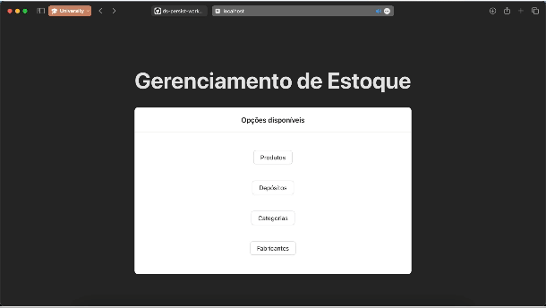

# Work 02 - Software Development for Persistence

## Product Management System :department_store:

Welcome to the repository of our product management system. This comprehensive solution is designed to enhance and simplify the strategic administration of products for businesses.

## Screenshots

### Key Entities:
`Products:` A robust database providing detailed information on specifications, pricing, and availability of each product, offering a comprehensive view of the product portfolio.

`Manufacturers:` We've integrated manufacturers into the system to provide clear insights into the origin and production details of each product.

`Product Categories:` An organizational framework allowing precise classification of products, facilitating navigation and implementation of specific management strategies.

`Stocks (Deposit Locations):` Optimize logistics and inventory control by strategically mapping deposit locations, enabling efficient tracking and management of the physical distribution of products.

## Specifications

### Technologies

- Frontend: Vuejs + Typescript
- Backend: Kotlin + Spring Boot
- Database: Posgres

## Ideas :bulb:

1. Try to remove DTO layer (over engineering) and Service layer (if possible) 
2. Use pagination directly from database
3. Compose different filters in a composed query
